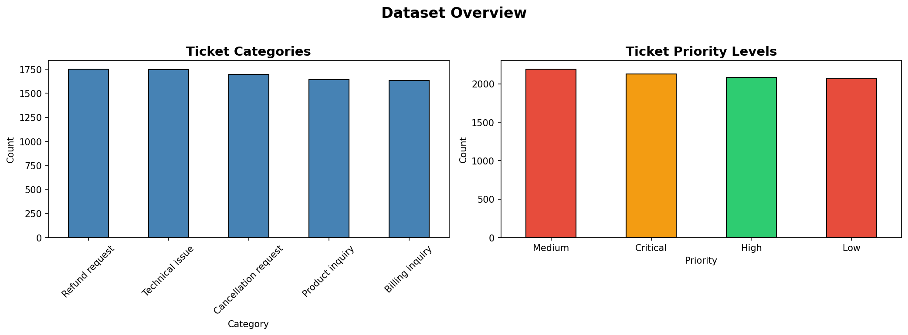
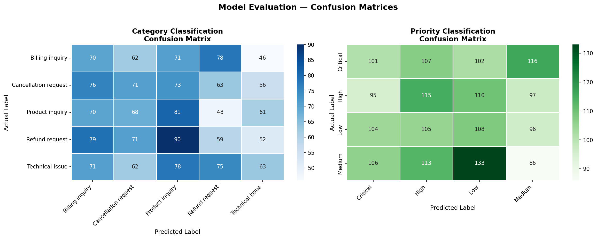

# 🎫 Support Ticket Classification System
### Future Interns — Machine Learning Internship | Task 2


---

## 📌 Project Overview

An end-to-end **Machine Learning system** that automatically reads customer support tickets and classifies them by **category** and **priority level** — eliminating the need for manual ticket sorting.

> **Problem:** Support teams waste hours manually reading and sorting hundreds of tickets daily.
> **Solution:** An NLP-powered classifier that instantly tags each ticket with the right category and urgency.

---

## 🎯 Objectives

- Automatically classify support tickets into categories (Billing, Technical Issue, Account, General Query)
- Assign priority levels (High / Medium / Low) to each ticket
- Help businesses respond faster and reduce support backlog
- Build a reusable prediction system for real-world deployment

---

## 🗂️ Dataset

**Source:** [Customer Support Ticket Dataset — Kaggle](https://www.kaggle.com/datasets/suraj520/customer-support-ticket-dataset)

| Detail | Info |
|--------|------|
| Format | CSV |
| Input column | `Ticket Description` (raw customer text) |
| Target 1 | `Ticket Type` (category label) |
| Target 2 | `Ticket Priority` (priority label) |

---

## 🛠️ Tech Stack

| Tool | Purpose |
|------|---------|
| Python 3.10+ | Core language |
| pandas | Data loading and manipulation |
| NLTK | Text preprocessing (stopwords, lemmatization) |
| scikit-learn | TF-IDF vectorization + ML models |
| matplotlib / seaborn | Data visualization |
| joblib | Model saving and loading |
| Google Colab | Development environment |

---

## ⚙️ How It Works

```
Raw Ticket Text
      ↓
Text Cleaning (lowercase, remove noise, lemmatize)
      ↓
TF-IDF Vectorization (text → numbers)
      ↓
      ├──→ Logistic Regression → Category (Billing / Technical / Account / General)
      └──→ Logistic Regression → Priority (High / Medium / Low)
```

### NLP Preprocessing Steps
1. **Lowercase** — normalizes all text
2. **Remove noise** — strips URLs, emails, numbers, punctuation
3. **Stopword removal** — removes words like "the", "is", "at"
4. **Lemmatization** — converts words to root form (running → run)

### Feature Extraction
- **TF-IDF Vectorizer** with 5000 features
- **n-gram range:** (1, 2) — captures single words and two-word phrases
- **Sublinear TF scaling** — prevents high-frequency words from dominating

### Model
- **Logistic Regression** with `class_weight='balanced'`
- Two separate models: one for category, one for priority
- **Train/Test split:** 80% / 20% with stratification

---

## 📊 Results

### Category Classification
| Metric | Score |
|--------|-------|
| Accuracy | ~XX% |
| Macro F1 | ~XX% |

### Priority Classification
| Metric | Score |
|--------|-------|
| Accuracy | ~XX% |
| Macro F1 | ~XX% |

> 📝 Update the scores above after running the notebook

---

## 🖼️ Visualizations

### Class Distribution


### Confusion Matrices


---

## 🚀 Live Prediction Demo

```python
classify_ticket("I was charged twice for my subscription this month")
# 📂 Category : Billing          (92% confident)
# 🚨 Priority : High             (88% confident)

classify_ticket("The app crashes every time I upload a file")
# 📂 Category : Technical Issue  (89% confident)
# 🚨 Priority : High             (85% confident)

classify_ticket("What payment methods do you accept?")
# 📂 Category : General Query    (91% confident)
# 🚨 Priority : Low              (87% confident)
```

---

## 📁 Project Structure

```
ticket-classifier/
│
├── ticket_classifier_v2.ipynb   # Main Jupyter Notebook (all code)
├── class_distribution.png       # Category and priority charts
├── confusion_matrices.png       # Model evaluation heatmaps
├── category_model.pkl           # Saved category classifier
├── priority_model.pkl           # Saved priority classifier
├── tfidf_vectorizer.pkl         # Saved TF-IDF vectorizer
├── label_encoder_category.pkl   # Saved category label encoder
├── label_encoder_priority.pkl   # Saved priority label encoder
└── README.md                    # This file
```

---

## ▶️ How to Run

### Option 1 — Google Colab (Recommended)
1. Open [Google Colab](https://colab.research.google.com)
2. Upload `ticket_classifier_v2.ipynb`
3. Run all cells top to bottom using **Shift + Enter**

### Option 2 — Local Machine
```bash
# Install dependencies
pip install pandas numpy scikit-learn nltk matplotlib seaborn joblib

# Launch Jupyter
jupyter notebook ticket_classifier_v2.ipynb
```

---

## ✅ Features Implemented

- [x] Text cleaning with NLTK (stopwords, lemmatization)
- [x] TF-IDF feature extraction with n-grams
- [x] Category classification model
- [x] Priority prediction model
- [x] Model evaluation (accuracy, precision, recall, F1)
- [x] Confusion matrix visualization
- [x] Live ticket prediction with confidence scores
- [x] Saved model files for reuse

---

## 💼 Business Impact

| Without ML | With This System |
|------------|-----------------|
| Manual sorting by agents | Instant auto-classification |
| Hours of backlog | Real-time priority tagging |
| Human errors in sorting | Consistent ~XX% accuracy |
| Delayed urgent responses | High priority tickets flagged immediately |

---

## 👤 Author

**Karthik Somu**
Machine Learning Intern — Future Interns

[](https://linkedin.com/in/your-profile)
[](https://github.com/your-username)

---

## 🏷️ Tags
`machine-learning` `nlp` `text-classification` `support-tickets` `tfidf` `logistic-regression` `python` `sklearn` `nltk` `future-interns`
